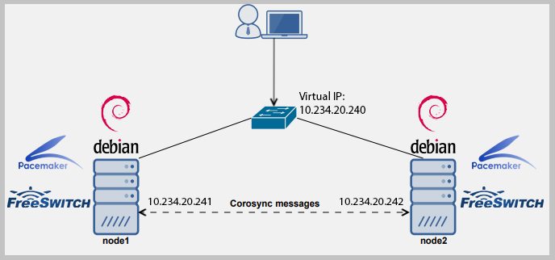

## FreeSWITCH Corosync & Pacemaker Cluster

### In this README I'll show you how to **Install/Configure and Test** Corosync & Pacemaker with Real-time Call Recovering in the FreeSWITCH 

#### You must Prepare 3 servers wth Debian 9 (Create VMs or use a physical machines)
##### For example we have 3 servers and 1 Virtual IP :
- 1 Machine - FreeSWITCH node1 - (e.g. `10.234.20.241`)
- 2 Machine - FreeSWITCH node2 - (e.g.`10.234.20.242`)
- 3 Machine - PGSQL Server -  (e.g.`10.234.20.231`)
- And Virtual/Floating IP -  (e.g.`10.234.20.240`)



##### You should add to your nodes IP addresses into `/etc/hosts` on both FS servers :
```bash
10.234.20.241 node1
10.234.20.242 node2
```
Change your server hostname

- For node1 :
```bash
$ echo 'node1' > /etc/hostname
```
- For node2 :
```bash
$ echo 'node2' > /etc/hostname
```


####  Firstly we need install Corosync/Pacemaker on both FS servers :

```bash
$ apt install corosync pacemaker pcs -y 
$ systemctl start pcsd.service && systemctl enable pcsd.service
$ echo -e "123456\n123456\n"|passwd hacluster 2>&1 >/dev/null
$ systemctl stop corosync.service && rm -rf /etc/corosync/corosync.conf 
$ echo "net.ipv4.ip_nonlocal_bind=1" >> /etc/sysctl.conf
$ sysctl -p
````
#### For each servers (node1,node2) you will create  `/usr/lib/ocf/resource.d/heartbeat/procallrecover` file and add the following lines :
```bash
#!/usr/bin/env bash

if [ $# -lt 1 ]
then
    echo "Usage : $0 start"
    exit
fi

case "$1" in
  start)
     /usr/bin/fs_cli -x "sofia recover"
         /bin/echo Log date: `date +%F-%H-%M-%S` >> /var/log/recovering.log
     ;;
  *)
     echo "Signal number $1 is not processed"
     ;;
esac
```

- Also set the permission:
```bash
$ chmod 777 /usr/lib/ocf/resource.d/heartbeat/procallrecover
```
#### Next some actions you'll execute only in **node1** server:

- **Auth/Setup/Enable the Cluster:**
```bash
$ pcs cluster auth node1 node2 -u hacluster -p '123456' --force
$ pcs cluster setup --force --name fs_cluster node1 node2
$ pcs cluster enable --all && sleep 7 && pcs cluster start --all
```
- **Disable Stonith/Quorum Policy:**

```bash
$ pcs property set stonith-enabled=false
$ pcs property set no-quorum-policy=ignore
$ pcs resource defaults resource-stickiness=100
$ pcs cluster cib clust_cfg
$ pcs -f clust_cfg property set no-quorum-policy=ignore
$ pcs -f clust_cfg resource defaults resource-stickiness=100
```
- **Create Resource1 - for Floating (Virtual IP) for the Corosync:**
```bash
$ pcs -f clust_cfg resource create procall_floating_ip ocf:heartbeat:IPaddr2 ip=10.234.20.240 cidr_netmask=24 op monitor interval=1s
```
- **Create Resource2 - for Call Recover Script for the FreeSWITCH:**
```bash
$ pcs -f clust_cfg resource create procall_call_recover ocf:heartbeat:procallrecover start op monitor interval=1s --force 2>&1 >/dev/null
```
- **Create Resource Group:**
```bash
$ pcs -f clust_cfg resource group add procallgroup procall_floating_ip procall_call_recover
```
- **Run the Resources:**
```bash
$ pcs -f clust_cfg constraint && pcs -f clust_cfg resource show && pcs cluster cib-push clust_cfg
```

##### Execute the following lines on the both FS servers then restart them:
```bash
$ systemctl start corosync pcsd pacemaker
$ systemctl enable corosync pcsd pacemaker
$ reboot
```

##### After restart you can check Primary/Secondary Node (Cluster server with floating IP):
```bash
# Check Online Cluster hosts:
$ pcs status |grep 'Online'
# Check the Primary Cluster:
$ pcs status |grep 'Current DC:'|cut -f1 -d'('
```

### Install and Configure PostgreSQL 10 (on the third server):

```bash
$ apt install sudo -y
$ echo "deb [arch=amd64] http://apt.postgresql.org/pub/repos/apt/ stretch-pgdg main" > /etc/apt/sources.list.d/pgdg.list
$ curl -sSL https://www.postgresql.org/media/keys/ACCC4CF8.asc | apt-key add -
$ apt update
$ apt install -y postgresql-10
$ sed -i 's/max_connections = 100/max_connections = 1000/g' /etc/postgresql/10/main/postgresql.conf 
$ echo "listen_addresses = '*'" >> /etc/postgresql/10/main/postgresql.conf
$ systemctl enable postgresql && systemctl start postgresql
```
- Add the following lines into **/etc/postgresql/10/main/pg_hba.conf**
```bash
host    all             all             10.234.20.0/24            md5
```

-  Restart the PostgreSQL Service:
```bash
systemctl restart postgresql
```


- Then you'll create Username & Databases:
```bash
$ su - postgres -c "psql -c \"CREATE DATABASE fssync ;\""
$ su - postgres -c "psql -c \"CREATE USER fssyncuser WITH PASSWORD 'C0r0SyncFS';\""
$ su - postgres -c "psql -c \"GRANT ALL PRIVILEGES ON DATABASE  fssync TO fssyncuser;\""
```


### Configure FreeSWITCH for Call Recovering on both servers (node1,node2):
- Add the following lines (but with your PostgreSQL Connections) into **/etc/freeswitch/autoload_configs/switch.conf.xml**:
```bash
    <param name="switchname" value="procall"/>
    <param name="core-db-dsn" value="pgsql://hostaddr=10.234.20.231 dbname=fssync user=fssyncuser password='C0r0SyncFS' options='-c client_min_messages=NOTICE'" />
    <param name="core-recovery-db-dsn" value="pgsql://hostaddr=10.234.20.231 dbname=fssync user=fssyncuser password='C0r0SyncFS' options='-c client_min_messages=NOTICE'" />
```

- Add the following lines (but with your PostgreSQL Connections) into **/etc/freeswitch/sip_profiles/internal.xml**:
```bash
<param name="track-calls" value="true" />
<param name="odbc-dsn" value="pgsql://hostaddr=10.234.20.231 dbname=fssync user=fssyncuser password='C0r0SyncFS' options='-c client_min_messages=NOTICE'"/>
```
- Add the following lines (but with your PostgreSQL Connections) into **/etc/freeswitch/sip_profiles/external.xml**:
```bash
<param name="track-calls" value="true" />
<param name="odbc-dsn" value="pgsql://hostaddr=10.234.20.231 dbname=fssync user=fssyncuser password='C0r0SyncFS' options='-c client_min_messages=NOTICE'"/>
```

#### Actually you can also add same database connections for all modules. It's your choise
```bash
<param name="odbc-dsn" value="pgsql://hostaddr=10.234.20.231 dbname=fssync user=fssyncuser password='C0r0SyncFS' options='-c client_min_messages=NOTICE'"/>
```
- Change FreeSWITCH IP to the your Virtual cluster IP  into **/etc/freeswitch/vars.xml**:
```bash
<X-PRE-PROCESS cmd="set" data="local_ip_v4=10.234.20.240"/>
```

- Then Restart the FreeSWITCH on both servers:
```bash
systemctl restart freeswitch
```

### Testing :

- Register SIP Number e.g. `1001` in Jitsi on your Laptop and e.g `1002` number in other Laptop
- Make call and answer
- Now you must suddenly shutdown the primary server (with hypervisor or Vcenter)
- If your configs is correct then the voice should migrate to the second server in 2-3 seconds