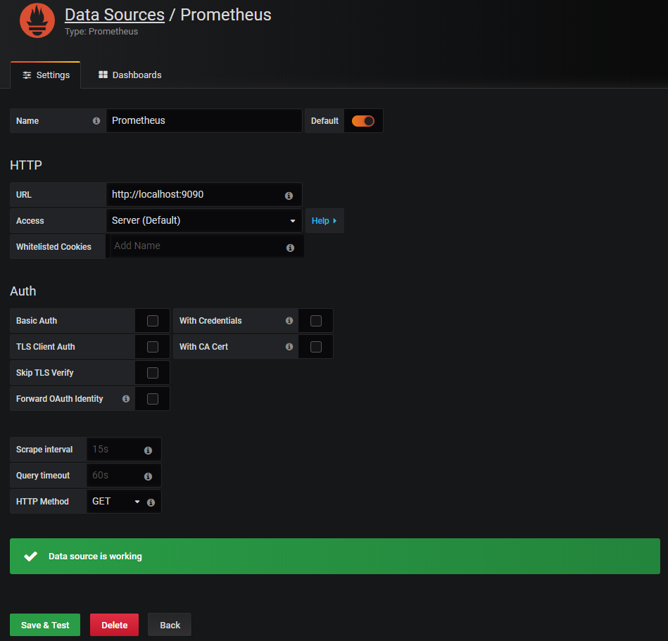
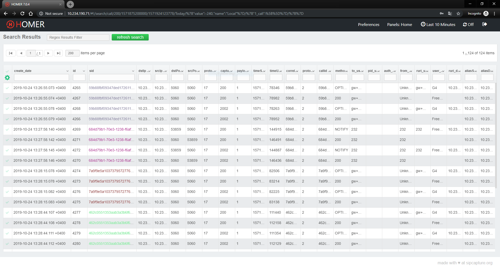
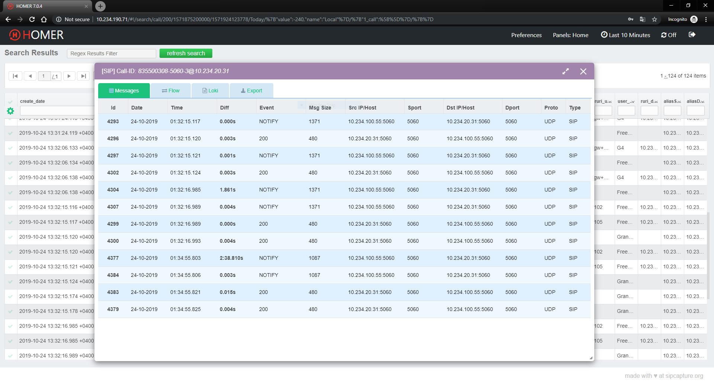
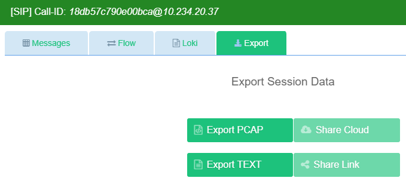
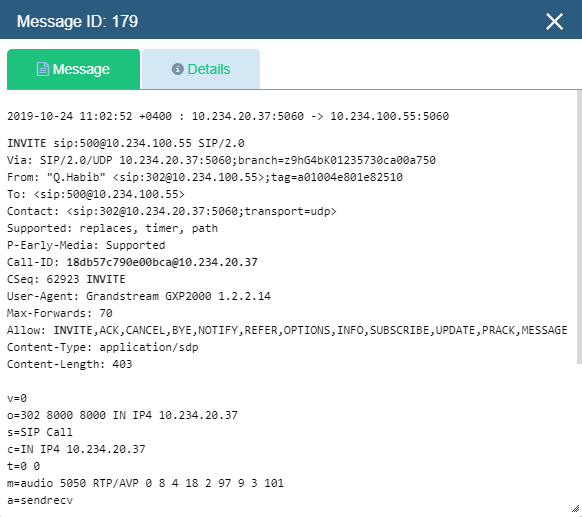
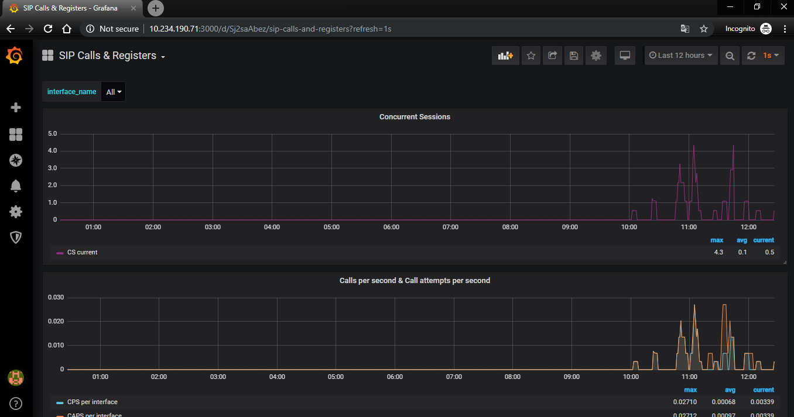
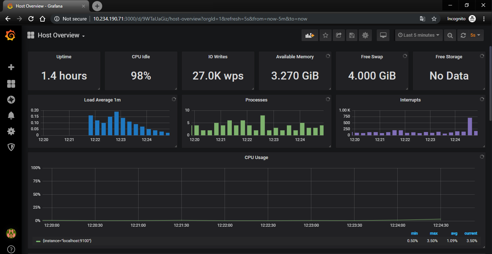
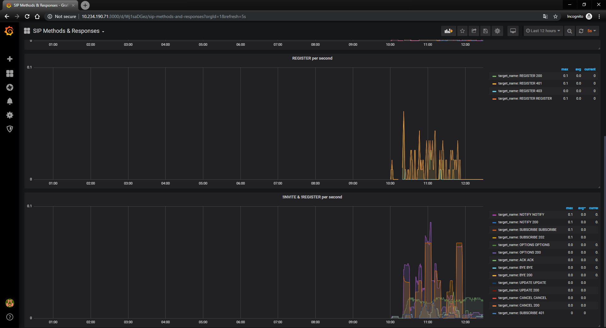

## In this README I'll explain to you - How to install **Homer7 VoIP Monitoring System with Grafana**

### About Homer7:

HOMER is part of the SIPCAPTURE stack: A robust, carrier-grade and modular VoIP and RTC Capture Framework for Analysis and Monitoring with native support for all major OSS Voice platforms and vendor-agnostic Capture agents. HOMER counts thousands of deployments worldwide including notorious industry vendors, voice network operators and fortune 500 enterprises, providing advanced search, end-to-end analysis and packet drill-down capabilities for ITSPs, VoIP Providers and Trunk Suppliers using and relying on VoIP services and RTC technologies - All 100% Open-Source


#### Component Overview:
- HEPlify Capture Agent - Captures SIP / RTP / RTCP traffic from interfaces and sends it to the HEPlify server (Should be installed in FreeSWITCH (VoIP) Server)
- HEPlify Server - Receives all the data, and then sends it to all other components in the proper format.
- PostgreSQL 10 -HEPlify-Server and Homer7 stores all the raw data that it receives from the HEPlify Capture agent.
- Prometheus Retrieves and stores time series data from the HEPlify Capture agent.
- Prometheus Node-Exporter - This is an exporter of Prometheus, it is necessary to collect data on the status of the server (CPU,RAM,SWAP etc.)
- Homer-app User WEB interface HOMER 7.
- Grafana Needed for visualization, it reads data from Prometheus and displays it in a human-friendly form.


###### P.S In my installation > 10.234.190.71 - Homer7 Server | 10.234.100.55 FreeSWITCH Server


##### # Install GoLang:
```bash
$ apt update && apt upgrade -y && apt install sudo -y && apt install libpcap-dev -y
$ wget https://dl.google.com/go/go1.13.1.linux-amd64.tar.gz && tar -xvf go1.13.1.linux-amd64.tar.gz
$ mv go /usr/local && export GOROOT=/usr/local/go && export GOPATH=$HOME/Projects/Proj1
$ export PATH=$GOPATH/bin:$GOROOT/bin:$PATH
```

##### # Install PostgreSQL 10:

```bash
$ apt install sudo -y
$ echo "deb [arch=amd64] http://apt.postgresql.org/pub/repos/apt/ stretch-pgdg main" > /$ etc/apt/sources.list.d/pgdg.list
$ curl -sSL https://www.postgresql.org/media/keys/ACCC4CF8.asc | apt-key add -
$ apt update
$ apt install -y postgresql-10
$ cd /etc/postgresql/10/main
$ sed -i 's/max_connections = 100/max_connections = 1000/g' postgresql.conf 
$ systemctl enable postgresql && systemctl start postgresql
```

- Create Username & Databases:
```bash
$ su - postgres -c "psql -c \"CREATE DATABASE homer_data ;\""
$ su - postgres -c "psql -c \"CREATE DATABASE homer_config ;\""
$ su - postgres -c "psql -c \"CREATE USER homeruser WITH PASSWORD 'Fr33sw11tchH00m33r';\""
$ su - postgres -c "psql -c \"GRANT ALL PRIVILEGES ON DATABASE  homer_data TO homeruser;\""
$ su - postgres -c "psql -c \"GRANT ALL PRIVILEGES ON DATABASE  homer_config TO homeruser;\""
$ su - postgres -c "psql -c \"ALTER USER homeruser WITH SUPERUSER;\""
```

##### # Install HEPlify Server:
```bash
$ cd /opt
$ git clone https://github.com/sipcapture/heplify-server
$ cd heplify-server
$ go build cmd/heplify-server/heplify-server.go
$ cp /opt/heplify-server/example/homer7_config/heplify-server.toml /opt/heplify-server/
```
- Edit config file **/opt/heplify-server/heplify-server.toml**  (Set your PGSQL Credentials):
```bash
HEPAddr               = "0.0.0.0:9060"
HEPTCPAddr            = ""
HEPTLSAddr            = "0.0.0.0:9060"
ESAddr                = ""
ESDiscovery           = true
LokiURL               = ""
LokiBulk              = 200
LokiTimer             = 4
LokiBuffer            = 100000
LokiHEPFilter         = []
ForceHEPPayload       = []
PromAddr              = "0.0.0.0:9096"
PromTargetIP          = ""
PromTargetName        = ""
DBShema               = "homer7"
DBDriver              = "postgres"
DBAddr                = "localhost:5432"
DBUser                = "homeruser"
DBPass                = "Fr33sw11tchH00m33r"
DBDataTable           = "homer_data"
DBConfTable           = "homer_config"
DBBulk                = 200
DBTimer               = 4
DBBuffer              = 400000
DBWorker              = 8
DBRotate              = true
DBPartLog             = "2h"
DBPartSip             = "1h"
DBPartQos             = "6h"
DBDropDays            = 14
DBDropDaysCall        = 0
DBDropDaysRegister    = 0
DBDropDaysDefault     = 0
DBDropOnStart         = false
Dedup                 = false
DiscardMethod         = []
AlegIDs               = []
CustomHeader          = []
LogDbg                = ""
LogLvl                = "info"
LogStd                = false
LogSys                = false
Config                = "./heplify-server.toml"
ConfigHTTPAddr        = ""
```
- Create System Service File and Start :
```bash
$ cp /opt/heplify-server/example/heplify-server.service /etc/systemd/system/
$ systemctl daemon-reload
$ systemctl enable heplify-server
$ systemctl start heplify-server
```

##### # Install Prometheus: 
```bash
$ useradd -M -r -s /bin/false prometheus
$ mkdir /etc/prometheus
$ mkdir /var/lib/prometheus
$ chown prometheus:prometheus /etc/prometheus
$ chown prometheus:prometheus /var/lib/prometheus
$ cd ~ ; wget https://github.com/prometheus/prometheus/releases/download/v2.11.1/prometheus-2.11.1.linux-amd64.tar.gz
$ tar -xzf prometheus-2.11.1.linux-amd64.tar.gz
$ pushd prometheus-2.11.1.linux-amd64 && chmod -R 777 *
$ popd
$ cp prometheus-2.11.1.linux-amd64/prometheus /usr/local/bin/prometheus
$ cp prometheus-2.11.1.linux-amd64/promtool /usr/local/bin/promtool
$ chown prometheus:prometheus /usr/local/bin/prometheus
$ chown prometheus:prometheus /usr/local/bin/promtool
$ cp -r prometheus-2.11.1.linux-amd64/consoles /etc/prometheus/
$ cp -r prometheus-2.11.1.linux-amd64/console_libraries/ /etc/prometheus/
$ chown -R prometheus:prometheus /etc/prometheus/consoles
$ chown -R prometheus:prometheus /etc/prometheus/console_libraries
$ cp /opt/heplify-server/docker/hep-prom-graf/prometheus/prometheus.yml /etc/prometheus/
$ chown prometheus:prometheus /etc/prometheus/prometheus.yml
```

- Add the Following Lines to **/etc/prometheus/prometheus.yml**
```bash
cat <<EOF > /etc/prometheus/prometheus.yml
global:
  scrape_interval:     15s
  evaluation_interval: 15s

  # Attach these labels to any time series or alerts when communicating with
  # external systems (federation, remote storage, Alertmanager).
  external_labels:
      monitor: 'docker-heplify-server'

# Load and evaluate rules in this file every 'evaluation_interval' seconds.
rule_files:
  - "alert.rules"

# A scrape configuration containing exactly one endpoint to scrape.
scrape_configs:
  - job_name: 'nodeexporter'
    scrape_interval: 5s
    static_configs:
      - targets: ['localhost:9100']

  - job_name: 'prometheus'
    scrape_interval: 10s
    static_configs:
      - targets: ['localhost:9090']

  - job_name: 'heplify-server'
    scrape_interval: 5s
    static_configs:
      - targets: ['localhost:9096']
EOF
```
- Create System Service File:
```bash
cd /etc/systemd/system/ && vim prometheus.service   
or 
cat <<EOF > etc/systemd/system/prometheus.service   
[Unit]
Description=Prometheus
Wants=network-online.target
After=network-online.target victoriametrics.service
[Service]
User=prometheus
Group=prometheus
Type=simple
ExecStart=/usr/local/bin/prometheus --config.file /etc/prometheus/prometheus.yml --storage.tsdb.path /var/lib/prometheus/ --web.console.templates=/etc/prometheus/consoles --web.console.libraries=/etc/prometheus/console_libraries
 
[Install]
WantedBy=multi-user.target
EOF
```
- Start the Service:
```bash
$ systemctl daemon-reload
$ systemctl start prometheus
$ systemctl enable prometheus
```
##### # Install Prometheus Node-Exporter:
```bash
$ wget https://github.com/prometheus/node_exporter/releases/download/v0.18.1/node_exporter-0.18.1.linux-amd64.tar.gz
$ tar -xzf node_exporter-0.18.1.linux-amd64.tar.gz
$ pushd node_exporter-0.18.1.linux-amd64
$ cp node_exporter /usr/local/bin
$ chmod 777 /usr/local/bin/node_exporter
```
- Create System Service File:
```bash
cat <<EOF > /etc/systemd/system/node_exporter.service
[Unit]
Description=Prometheus
Wants=network-online.target
After=network-online.target
  
[Service]
User=prometheus
Group=prometheus
Type=simple
ExecStart=/usr/local/bin/node_exporter --path.procfs=/proc --path.sysfs=/sys --collector.filesystem.ignored-mount-points=^/(sys|proc|dev|host|etc)($$|/)
[Install]
WantedBy=multi-user.target
EOF
```
- Start the Service:
```bash
$ systemctl daemon-reload
$ systemctl enable node_exporter
$ systemctl start node_exporter
```

##### # Install Homer Web-Application:
```bash
cd /opt ; git clone https://github.com/sipcapture/homer-app
curl -o- https://raw.githubusercontent.com/nvm-sh/nvm/v0.34.0/install.sh | bash
source ~/.bashrc
nvm install 8.9.1
cd /opt/homer-app
npm install webpack@3.1.0
npm install less@2.3.1
npm install popper.js@1.14.7
npm install @babel/core@7.0.0-beta.40
npm install pg@7.11.0
npm install && npm install -g knex eslint eslint-plugin-html eslint-plugin-json eslint-config-google
```

- Edit config file **/opt/homer-app/server/config.js**  (Set your PGSQL Credentials):
```java
const pgsql = {
  host: 'localhost',
  user: 'homeruser',
  port: 5432,
  password: 'Fr33sw11tchH00m33r',
  charset: 'utf8',
  timezone: 'utc',
  pool: {
    afterCreate: function(connection, callback) {
      connection.query('SET timezone = "UTC";', function(err) {
        callback(err, connection);
      });
    },
  },
};
```
-  Run the NPM Build:
```bash
$ cd /opt/homer-app/
$ npm run build
```
- Create System Service File:
```bash
cat <<EOF > /etc/systemd/system/homer-app.service
[Unit]
Description=Homer 7 UI
After=network.target

[Service]
WorkingDirectory=/opt/homer-app
ExecStart=/root/.nvm/versions/node/v8.9.1/bin/node --max_old_space_size=2048 /opt/homer-app/bootstrap.js
Restart=on-failure
RestartSec=10s
Type=simple

[Install]
WantedBy=multi-user.target
EOF
```
- Start the Service:
```bash
$ systemctl daemon-reload
$ systemctl enable homer-app
$ systemctl start homer-app
```
##### # Install Grafana-Server:
```bash
$ apt-get install -y software-properties-common
$ add-apt-repository "deb https://packages.grafana.com/oss/deb stable main"
$ wget -q -O - https://packages.grafana.com/gpg.key | apt-key add -
$ apt-get install  apt-transport-https
$ apt update && apt install grafana -y
```
- Start the Service:
```bash
$ systemctl enable grafana-server
$ systemctl start grafana-server
```

##### # Configure Grafana-Server:

#### For Grafana go to **http://10.234.190.71:3000/**
###### Default Credentials for Grafana
- Username : `admin`
- Password : `admin`
  
- 

- Go to Datasource and select Prometheus
`Default name for Datasource will be Prometheus`
- Choose URL http://localhost:9090
- Click “Save & Test” if everything is OK, You should see “Datasource is working”

- Go to Dashboards > Manage and select import **json** dashboard files:

- Add dashboards from [Grafana-SIP-Dashboards](https://github.com/sipcapture/homer-docker/tree/master/heplify-server/hom7-hep-prom-graf/grafana/provisioning/dashboards)

##### Dashboards:
- Host_Overview.json	
- QOS_Horaclifix.json	
- QOS_RTCP.json
- QOS_XRTP.json	
- SIP_Calls&Registers.json
- SIP_Error_Rates.json	
- SIP_Methods&Responses.json 
- SIP_Overview.json


### Congratulations! Homer7 & Grafana Successfully Installed !
---
#### FreeSWITCH Configuration 

##### In the VoIP Server (e.g. FreeSWITCH Server) we should install HEPlify Capture Agent

##### # Firstly you'll Install GoLang:
```bash
$ apt update && apt upgrade -y && apt install sudo -y && apt install libpcap-dev -y
$ wget https://dl.google.com/go/go1.13.1.linux-amd64.tar.gz && tar -xvf $ go1.13.1.linux-amd64.tar.gz
$ mv go /usr/local && export GOROOT=/usr/local/go && export GOPATH=$HOME/Projects/Proj1
$ export PATH=$GOPATH/bin:$GOROOT/bin:$PATH
```

##### # Install HEPlify Capture Agent:
```bash
$ git clone https://github.com/sipcapture/heplify
$ pushd heplify/ && make && popd && mv heplify/ /opt/heplify && cd /opt/heplify && chmod -R 777 *
```
- Create System Service File (Change IP to Your Homer7 Server IP):
```bash
cat <<EOF > /etc/systemd/system/heplify.service
[Unit]
Description=Captures packets from wire and sends them to Homer
After=network.target

[Service]
WorkingDirectory=/opt/heplify
ExecStart=/opt/heplify/heplify -i ens192 -hs 10.234.190.71:9060 -m SIPRTCP
ExecStop=/bin/kill ${MAINPID}
Restart=on-failure
RestartSec=10s
Type=simple

[Install]
WantedBy=multi-user.target
EOF
```
- Start the Service:
```bash
$ systemctl daemon-reload
$ systemctl enable heplify.service
$ systemctl start heplify.service
```

##### # Enable Capture from FreeSWITCH:

- Add the following lines to **/etc/freeswitch/autoload_configs/sofia.conf.xml** :
You should Change IP to your Homer7 Server IP
```xml
<param name="capture-server" value="udp:10.234.190.71:9060"/>
```
- Open **/etc/freeswitch/sip_profiles/internal.xml** and change sip-capture param to "yes" :
```xml
<param name="sip-capture" value="yes"/>
```
- To enable/disable the HEP agent on demand, you can use CLI commands:
```bash
$ fs_cli -x 'sofia global capture on'
$ fs_cli -x 'sofia profile internal capture on'
```

- Restart the FreeSWITCH:
```bash
$ systemctl restart freeswitch
```

## Work is Done !


#### Go to (Homer7-Server-IP) **http://10.234.190.71/**  input credentials and click to `Login` 
###### Default Credentials for Homer7
- Username : `admin`
- Password : `sipcapture`

- 

#### For Grafana go to **http://10.234.190.71:3000/**
###### Default Credentials for Grafana
- Username : `admin`
- Password : `admin`
  
- 

### Final Result (part of Homer7 and Grafana) :

#### Homer7 Examples :
- **SIP Captures**

- **SIP Captures Details**

- **SIP Capture Export**

- **SIP Methods & Responses in Details**


#### Grafana Examples :

- **SIP Calls & Registers**

- **Host Information**

- **SIP Methods & Responses**



## Usefull Information About VOIP Monitoring :

#### Session Establishment Ratio (SER / ASR) 

   This metric is used to detect the ability of a terminating UA or
   downstream proxy to successfully establish sessions per new session
   INVITE requests.  SER is defined as the number of new session INVITE
   requests resulting in a 200 OK response, to the total number of
   attempted INVITE requests less the total number of attempted INVITE
   requests less INVITE requests resulting in a 3XX, 401, 402, and 407
   response.  The 3XX, 401, 402 and 407 response codes were chosen,
   because they indicate an acceptable recoverable UA effect without the
   interaction of an individual user of the UA.  This metric is similar
   to Answer Seizure Ratio (ASR) defined in [E.411].  It is measured at
   the originating UA only.  The output value of this metric is
   numerical and SHOULD be adjusted to indicate a percentage of
   successfully established sessions.  The SER is calculated using the
   following formula metric.

   In order to simplify the formula, the following variable is used to
   summarize multiple SIP responses:

   a = 3XX, 401, 402, and 407


                 # of INVITE Requests w/ associated 200 OK
   SER = --------------------------------------------------------- x 100
     (Total # of INVITE Requests)-(# of INVITE Requests w/ 'a' Response)


   The following message exchange provides an example of identifiable
   events necessary for inputs in determining session establishment as
   described above:


                           UA1                 UA2
                            |                   |
                            |INVITE             |
               +----------->|------------------>|
               |            |                180|
               |            |<------------------|
      Session Established   |                   |
               |            |                   |
               |            |                200|
               +----------->|<------------------|
                            |                   |


   The following is an example call flow including a SIP 302 Redirect
   response.


                            UA1                 UA2                 UA3
                             |                   |                   |
                +----------->|INVITE             |                   |
                |            |------------------>|                   |
      INVITE w/ 'a' Response |                   |                   |
                |            |                302|                   |
                +----------->|<------------------|                   |
                             |                   |                   |
                             |INVITE                                 |
                +----------->|-------------------------------------->|
                |            |                                       |
                |            |                                    180|
       Session Established   |<--------------------------------------|
                |            |                                       |
                |            |                                    200|
                +----------->|<--------------------------------------|
                             |                                       |
#### Network Effectiveness Ratio (NER)
The Network Effectiveness Ratio (NER) measures the ability of a network to deliver a call to the called terminal. Busy signals and other call failure due to user behaviour are counted as "successful call delivery" for NER calculation purposes. Unlike ASR, NER excludes the effects of customer and terminal behaviour. NER is a measure of network quality defined by the ITU.


In general, the Network Effective Ratio is used to calculate the effectiveness of the internal interconnect routes.

Network Efficiency Ratio was designed to eliminate user behavior as a factor and better represent pure network performance.
Network Efficiency Ratio [NER] is defined as:

User Answers or Normal call clearing      -       Cause code: 16
+ User Busy                       -       Cause code: 17
+ Ring No Answer               -       Cause code: 18 & 19
+ Terminal Rejects)            -       Cause code: 21
**NER** = -------------------------------------------------------x **100**
     (Total # of Call Attempts i.e. IAM’s)

#### SIP response codes

- **2xx** Successful Responses (For Example: 200 OK)
- **4xx** Client Failure Responses
- **401** Unauthorized (Used only by registrars or user agents. Proxies should use proxy authorization 407)
- **402** Payment Required (Reserved for future use)
- **480** Temporarily Unavailable
- **486** Busy Here
- **6xx** Global Failure Responses
- **600** Busy Everywhere
- **603** ADD


#### Useful Documentations :

[SIP KPIs](http://codec-translator.blogspot.com/2011/10/sip-peering-kpis-how-to-measure-answer.html)
[SIP Response Codes](https://www.websitepulse.com/kb/sip_response_status_codes)


### ENJOY !

