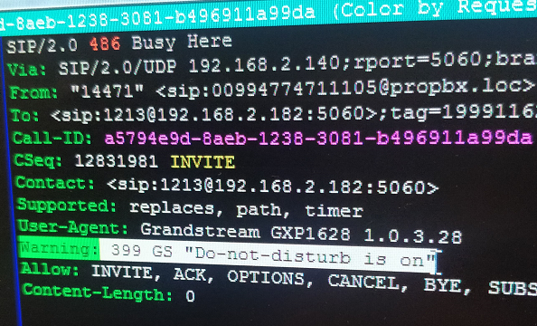
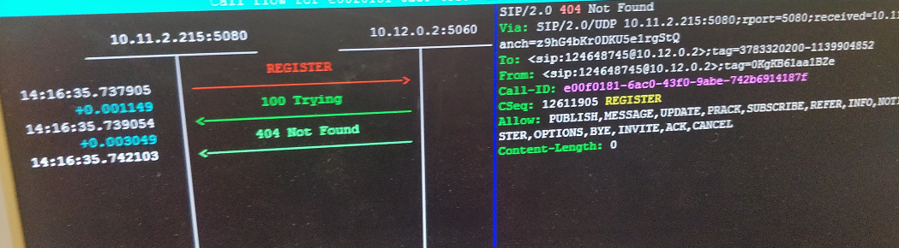
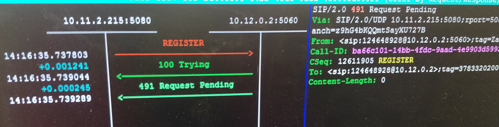
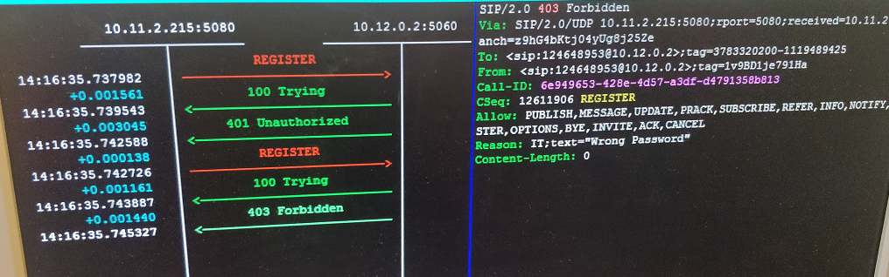

# SIP/2.0 Understanding , Analysis and Trobleshooting

##### This document was written in order to understand SIP analysis and improve troubleshooting skills.
---

## In this readme I'll show and explain you items listed below:
- SIP Request methods (with Azerbaijanian comments)
- Type of SIP Responses (with Azerbaijanian comments)
- SIP Response codes (in detail)
- SIP Call Flow Examples (RFC3665)
- Real troubleshoot examples (with photos)
- Useful information (my own experience)

## SIP Request methods:
SIP Sorğu metodları:
### There are fourteen SIP Request methods of which the first six are the most basic request / method types:

#### 1. `INVITE` - a client is being invited to participate in a call session
Sessiya yaradır (Dəvət edir) 
#### 2. `ACK` - confirms that the client has received a final response to an INVITE request;
INVITE tələbini təsdiqləyir.
#### 3.`BYE` - terminates a call and can be sent by either the caller or the callee;
Sessiyanı başa çatdırır.
#### 4.`CANCEL` - deletes any pending request;
Sessiyanın qurulmasını ləğv edir.
#### 5.`OPTIONS` - queries the capabilities of servers;
SIP istifadəçiyə(endpoint) zəng və qəbul etmək imkanları barədə məlumat verir.
#### 6.`REGISTER` - registers the address listed in the To header field with a SIP server;
İstifadəçi yeri ilə əlaqə qurur (host adı, IP).
#### 7.`PRACK` - provisional acknowledgement;
Müvəqqəti təsdiq
#### 8.`SUBSCRIBE` - subscribes for an Event of Notification from the Notifier;
Notifikatordan bildiriş üçün abunə olur.
#### 9.`NOTIFY` - notify the subscriber of a new Event;
Yeni bir hadisə barədə abunəçiyə xəbər verir.
#### 10.`PUBLISH` - publishes an event to the Server;
Serverə bir hadisə dərc edir.
#### 11.`INFO` - sends mid-session information that does not modify the session state;
Orta seans məlumatı göndərir.
#### 12.`REFER` - asks recipient to issue SIP request (call transfer);
Alıcıdan zəngi transfer etməsini xahiş edir.
#### 13.`MESSAGE` - transports instant messages using SIP;
SIP istifadə edərək ani mesajları ötürür (transport) edir;
#### 14.`UPDATE` - modifies the state of the session without changing the state of the dialog.
Bir seansın vəziyyətini dəyişdirir.

## Type of SIP Responses:
SIP Cavabların növləri:
### SIP Requests are answered with SIP responses, of which there are six classes:

#### `1XX` = Informational responses, such as 180 (ringing).
Məlumat xarakterli cavablar
#### `2XX` = Success responses.
Uğurlu cavablar
#### `3XX` = Redirection responses. 
Yönləndirmə cavabları
#### `4XX` = Request failures.
Uğursuz sorğular
#### `5XX` = Server errors.
Serverin səhfləri (SIP Server,SSP)
#### `6XX` = Global failures.
Global səhflər

## SIP Response codes:
SIP Cavab kodları:
### SIP responses are the codes used by Session Initiation Protocol for communication. We have put together a list of all the SIP responses known.
<h3><strong>1xx = Informational SIP Responses</strong></h2>
<ul>
<li><strong>100 Trying</strong> &#8211; Extended search is being performed so a forking proxy must send a 100 Trying response.</li>
<li><strong>180 Ringing</strong> &#8211; The Destination User Agent has received the INVITE message and is alerting the user of call.</li>
<li><strong>181 Call Is Being Forwarded</strong> &#8211; Optional, send by Server to indicate a call is being forwarded.</li>
<li><strong>182 Queued</strong> &#8211; Destination was temporarily unavailable, the server has queued the call until the destination is available.</li>
<li><strong>183 Session Progress</strong> &#8211; This response may be used to send extra information for a call which is still being set up.</li>
<li><strong>199 Early Dialog Terminated</strong> &#8211; Send by the User Agent Server to indicate that an early dialogue has been terminated.</li>
</ul>
<h3><strong>2xx = Success Responses</strong></h2>
<ul>
<li><strong>200 OK</strong> &#8211; Shows that the request was successful</li>
<li><strong>202 accepted</strong> &#8211; Indicates that the request has been accepted for processing, mainly used for referrals.</li>
<li><strong>204 No Notification</strong> &#8211; Indicates that the request was successful but no response will be received.</li>
</ul>
<h3><strong>3xx = Redirection Responses</strong></h2>
<ul>
<li><strong>300 Multiple Choices</strong> &#8211;  The address resolved to one of several options for the user or client to choose between.</li>
<li><strong>301 Moved Permanently</strong> &#8211; The original Request URI is no longer valid, the new address is given in the Contact header.</li>
<li><strong>302 Moved Temporarily</strong> &#8211; The client should try at the address in the Contact field.</li>
<li><strong>305 Use Proxy</strong> &#8211; The Contact field details a proxy that must be used to access the requested destination.</li>
<li><strong>380 Alternative Service</strong> &#8211; The call failed, but alternatives are detailed in the message body.</li>
</ul>
<h3><strong>4xx = Request Failures</strong></h2>
<ul>
<li><strong>400 Bad Request</strong> &#8211; The request could not be understood due to malformed syntax.</li>
<li><strong>401 Unauthorized</strong> &#8211; The request requires user authentication. This response is issued by UASs and registrars.</li>
<li><strong>402 Payment Required</strong> &#8211;  (Reserved for future use).</li>
<li><strong>403 Forbidden</strong> &#8211; The server understood the request, but is refusing to fulfil it.</li>
<li><strong>404 Not Found</strong> &#8211; The server has definitive information that the user does not exist at the (User not found).</li>
<li><strong>405 Method Not Allowed</strong> &#8211; The method specified in the Request-Line is understood, but not allowed.</li>
<li><strong>406 Not Acceptable</strong> &#8211; The resource is only capable of generating responses with unacceptable content.</li>
<li><strong>407 Proxy Authentication Required</strong> &#8211; The request requires user authentication.</li>
<li><strong>408 Request Timeout</strong> &#8211; Couldn&#8217;t find the user in time.</li>
<li><strong>409 Conflict</strong> &#8211; User already registered (deprecated)</li>
<li><strong>410 Gone</strong> &#8211; The user existed once but is not available here any more.</li>
<li><strong>411 Length Required</strong> &#8211; The server will not accept the request without a valid content length (deprecated).</li>
<li><strong>412 Conditional Request Failed </strong>&#8211; The given precondition has not been met.</li>
<li><strong>413 Request Entity Too Large</strong> &#8211; Request body too large.</li>
<li><strong>414 Request URI Too Long</strong> &#8211; Server refuses to service the request, the Req-URI is longer than the server can interpret.</li>
<li><strong>415 Unsupported Media Type</strong> &#8211; Request body is in a non-supported format.</li>
<li><strong>416 Unsupported URI Scheme</strong> &#8211; Request-URI is unknown to the server.</li>
<li><strong>417 Uknown Resource-Priority</strong> &#8211; There was a resource-priority option tag, but no Resource-Priority header.</li>
<li><strong>420 Bad Extension</strong> &#8211; Bad SIP Protocol Extension used, not understood by the server.</li>
<li><strong>421 Extension Required</strong> &#8211; The server needs a specific extension not listed in the Supported header.</li>
<li><strong>422 Session Interval Too Small</strong> &#8211; The request contains a Session-Expires header field with a duration below the minimum.</li>
<li><strong>423 Interval Too Brief</strong> &#8211; Expiration time of the resource is too short.</li>
<li><strong>424 Bad Location Information</strong> &#8211; The request&#8217;s location content was malformed or otherwise unsatisfactory.</li>
<li><strong>428 Use Identity Header</strong> &#8211; The server policy requires an Identity header, and one has not been provided.</li>
<li><strong>429 Provide Referrer Identity</strong> &#8211; The server did not receive a valid Referred-By token on the request.</li>
<li><strong>430 Flow Failed</strong> &#8211; A specific flow to a user agent has failed, although other flows may succeed.</li>
<li><strong>433 Anonymity Disallowed</strong> &#8211; The request has been rejected because it was anonymous.</li>
<li><strong>436 Bad Identity Info</strong> &#8211; The request has an Identity-Info header and the   URI scheme contained cannot be de-referenced.</li>
<li><strong>437 Unsupported Certificate</strong> &#8211; The server was unable to validate a certificate for the domain that signed the request.</li>
<li><strong>438 Invalid Identity Header</strong> &#8211; Server obtained a valid certificate used to sign a request, was unable to verify the signature.</li>
<li><strong>439 First Hop Lacks Outbound Support</strong> &#8211; The first outbound proxy doesn&#8217;t support the &#8220;outbound&#8221; feature.</li>
<li><strong>440 Max-Breadth Exceeded </strong>&#8211; If a SIP proxy determined a response context had insufficient Incoming Max-Breadth to carry out a desired parallel fork, and the proxy is unwilling/unable to compensate by forking serially or sending a redirect, that proxy MUST return a 440 response. A client receiving a 440 response can infer that its request did not reach all possible destinations. </li>
<li><strong>469 Bad Info Package </strong>&#8211; If a SIP UA receives an INFO request associated with an Info Package that the UA has not indicated willingness to receive, the UA MUST send a 469 response, which contains a Recv-Info header field with Info Packages for which UA is willing to receive INFO requests.</li>
<li><strong>470 Consent Needed</strong> &#8211; The source of the request did not have the permission of the recipient to make such a request.</li>
<li><strong>480 Temporarily Unavailable</strong> &#8211; Callee currently unavailable.</li>
<li><strong>481 Call/Transaction Does Not Exist</strong> &#8211; Server received a request that does not match any dialogue or transaction.</li>
<li><strong>482 Loop Detected</strong> &#8211; Server has detected a loop.</li>
<li><strong>483 Too Many Hops</strong> &#8211; Max-Forwards header has reached the value &#8216;0&#8217;.</li>
<li><strong>484 Address Incomplete</strong> &#8211; Request-URI incomplete.</li>
<li><strong>485 Ambiguous</strong> &#8211; Request-URI is ambiguous.</li>
<li><strong>486 Busy Here (or Do not disturb mode activated)</strong> &#8211; Callee is busy.</li>
<li><strong>487 Request Terminated</strong> &#8211; Request has terminated by bye or cancel.</li>
<li><strong>488 Not Acceptable Here</strong> &#8211; Some aspects of the session description of the Request-URI are not acceptable.</li>
<li><strong>489 Bad Event</strong> &#8211; The server did not understand an event package specified in an Event header field.</li>
<li><strong>491 Request Pending</strong> &#8211; Server has some pending request from the same dialogue.</li>
<li><strong>493 Undecipherable</strong> &#8211; UndecipherableRequest contains an encrypted MIME body, which recipient can not decrypt.</li>
<li><strong>494 Security Agreement Required</strong> &#8211; The server has received a request that requires a negotiated security mechanism.</li>
</ul>
<h3><strong>5xx = Server Errors</strong></h2>
<ul>
<li><strong>500 Server Internal Error</strong> &#8211; The server could not fulfill the request due to some unexpected condition.</li>
<li><strong>501 Not Implemented</strong> &#8211; The SIP request method is not implemented here.</li>
<li><strong>502 Bad Gateway</strong> &#8211; The server, received an invalid response from a downstream server while trying  to fulfill a request.</li>
<li><strong>503 Service Unavailable</strong> &#8211; The server is in maintenance or is temporarily overloaded and cannot process the request.</li>
<li><strong>504 Server Time-out</strong> &#8211; The server tried to access another server while trying  to process a request, no timely response.</li>
<li><strong>505 Version Not Supported</strong> &#8211; The SIP protocol version in the request is not supported by the server.</li>
<li><strong>513 Message Too Large</strong> &#8211; The request message length is longer than the server can process.</li>
<li><strong>555 Push Notification Service Not Supported </strong>&#8211; The server does not support the push notification serviced specified in the pn-provider SIP URI parameter.</li>
<li><strong>580 Precondition Failure</strong> &#8211; The server is unable or unwilling to meet some constraints specified in the offer.</li>
</ul>
<h3><strong>6xx = Global Failures</strong></h2>
<ul>
<li><strong>600 Busy Everywhere</strong> &#8211; All possible destinations are busy.</li>
<li><strong>603 Decline</strong> &#8211; Destination cannot/doen&#8217;t wish to participate in the call,  no alternative destinations.</li>
<li><strong>604 Does Not Exist Anywhere</strong> &#8211; The server has authoritative information that the requested user does not exist anywhere.</li>
<li><strong>606 Not Acceptable</strong> &#8211; The user&#8217;s agent was contacted successfully but some aspects of the session description were not acceptable.</li>
<li><strong>607 Unwanted </strong>&#8211; The called party did not want his call from the calling party. Future attempts from the calling party are likely to be similarly rejected. </li>

## SIP Call Flow Examples (RFC3665)

> Successful registration:

1.	The registrar returns a 401 Unauthorized response with a WWW-Authenticate header.  This header contains data that must be used to encrypt the user’s communications password. Specifically, it contains a nonce along with the name of the encryption algorithm that the client must use.
2.	The user sends a second REGISTER to the SIP registrar. This REGISTER contains an Authorization header.   Within Authorization is the user’s encrypted password.
3.	If the correct password is received by the registrar, a 200 Ok response is sent to signify a successful registration. An Expires header may be present with a different value than what the user requested.  This is the time the registration will be valid as determined by the registrar’s policies.


```
Endpoint                    SIP Server (FreeSWITCH,Asterisk,etc.)
  |                               |
  |          REGISTER F1          |
  |------------------------------>|
  |      401 Unauthorized F2      |
  |<------------------------------|
  |          REGISTER F3          |
  |------------------------------>|
  |            200 OK F4          |
  |<------------------------------|
  |                               |
```
> Unsuccessful registration:
```
Endpoint                    SIP Server (FreeSWITCH,Asterisk,etc.)
  |                               |
  |          REGISTER F1          |
  |------------------------------>|
  |      401 Unauthorized F2      |
  |<------------------------------|
  |          REGISTER F3          |
  |------------------------------>|
  |      401 Unauthorized F4      |
  |<------------------------------|
  |                               |
```

> Update of Contact List:
```
Endpoint                    SIP Server (FreeSWITCH,Asterisk,etc.)
  |                               |
  |          REGISTER F1          |
  |------------------------------>|
  |           200 OK F2           |
  |<------------------------------|
  |                               |
```
> Successful call flow:
```
   User A                   User B
     |                        |
     |       INVITE F1        | - Establishes a session.
     |----------------------->|
     |    180 Ringing F2      | – The Destination User's SIP Agent is alerting
     |<-----------------------|
     |                        |
     |       200 OK F3        | – Shows that the request was successful
     |<-----------------------|
     |         ACK F4         | - Confirms an INVITE request.
     |----------------------->|
     |   Both Way RTP Media   | - Talking
     |<======================>|
     |                        |
     |         BYE F5         | - Ends a session.
     |<-----------------------|
     |       200 OK F6        | – Shows that the request was successful
     |----------------------->|
     |                        |
```

## Real troubleshoot examples:
### Let’s see SNGREP Real Examples (Real Project issues):
1. IP Phone in the “Don’t disturb” mode. For the FreeSWITCH(default level) it just   486 Response (Busy here)



2. SSP deleted OMG’s SIP number.İt’s our real evidence.



3. There is example where SSP sent us 491 Request Pending (Server has some pending request from the same dialogue) after our register request.



4. There is example where SSP sent us 403 Forbidden,and you can see Reason: Wrong Password



## Useful Information:

### SNGREP 

SNGREP - is a tool for displaying SIP calls message flows. It supports live capture to display realtime SIP packets and can also be used as PCAP viewer.

There are my articles about SNGREP using:
1. [Install SNGREP and Capture SIP Trace Dump](https://progit.tk/voip/freeswitch/tree/master/SIP_Trace_Capture_Dump_SNGREP)
2. [SNGREP Dump Scheduler with TMUX](https://progit.tk/voip/freeswitch/tree/master/FreeSWITCH_Tmux_SNGREP_Scheduler)

FYI: Always carefully read the reason in SNGREP

### RPCAPD
Rpcapd - is a daemon that provides remote traffic capture for Windows version of Wireshark protocol analyzer. It is shipped with WinPcap network capture library for Windows but is absent from libpcap in Linux.

There is my article:

[Install/Configure and start to real-time packet capture with Wireshark](https://progit.tk/voip/freeswitch/tree/master/Realtime_SIP_Trace_Capture_Dump_RPCapd)


### Wireshark

#### Filter examples:

- SIP Requests:
```
sip.CSeq.method == "INVITE"
sip.CSeq.method == "REGISTER"
sip.CSeq.method == "BYE"
etc.
```
- SIP Request codes:
```
sip.Status-Code == 180
sip.Status-Code == 200
sip.Status-Code == 486
etc.
```

FYI:

Lost packets in VOIP (RTP) disrupt speech and create tone distortion. It is assumed that loss of up to 5% of packets is imperceptible, and over 10-15% is unacceptable. Moreover, these values significantly depend on the compression / decompression algorithms.

### Wireshark analyses (RTP troubleshooting) example:

Once I have a capture or two, I look to see if I can "see" the issue at all in the packet capture. Ideally, you'll capture the beginning of a problematic call so you can see the call setup and so that Wireshark automatically knows which packets belong to that call. If you can't catch the call setup in the capture, then Wireshark will not know that the UDP traffic is RTP and will just show it as UDP. Right-click on one of the UDP packets that is part of the conversation and click "Decode as", then select RTP from the list. You may have to do this for a packet in each direction of the conversation. Once that's done (if necessary) select one of the packets in the conversation and go to Telephony->RTP->Stream Analysis. This dialog gives you a lot of useful information. Here's a breakdown of what I look for here:

* Max Delta

This should typically be slightly higher than 20ms for RTP audio. The way to verify what your value should be close to is to look at the SDP packet from the call setup and see what the ptime media attribute field is set to. This number represents the number of milliseconds of audio represented in the audio packets. (See RFC4566 for details.) Standard packetization rate on every device I've seen is 20ms and that's what you'll typically see in the SDP header. So you know that in a perfect 0-latency-0-overhead world, your packets would come at 20ms intervals. Of course, we don't live in that world, so there's going to be some variation and there's always going to be some extra delay. But even if you have a higher-latency link between A and D, your delta should only be slightly higher than your ptime. High delta translates into high jitter and causes dropped packets on the receiving end. Even if you have a slow link between A and D and there's 150ms of latency, your delta will be close to 20ms as long as your latency is consistent. Consistency is far more important than low latency. With one issue I dealt with, I had a capture that showed a max jitter of 13ms, but a max delta of over 1000ms. The way jitter is calculated smooths out those max deltas--it is more of an average. So you can have some pretty ugly high deltas periodically mixed in with a majority of really good deltas, and your jitter will still look ok--but you'll hear quality issues. (See https://wiki.wireshark.org/RTP_statistics for some good info on how these statistics are calculated.) High deltas can result in "garbled" or "under water" sounding audio if the deltas result in sequence errors, and choppy audio if they don't.

* Max and Mean Jitter

In light of the discussion above, you can see that jitter may look good yet there still be problems. Nevertheless, jitter is a good measure of how your network is doing overall at delivering packets on time. The question that always comes up is how much jitter is too much. In my experience over the years, the answer is completely dependent on the devices you have on each end because the phones, PBX, or whatever is doing the analog to VoIP conversion all have a jitter buffer designed to absorb enough of the data stream to re-order any packets that get out of sequence due to jitter. If you have a 100ms jitter buffer and 120ms of jitter, you are going to have problems. On the other hand, if you have a 130ms jitter buffer, it will absorb that 120ms of jitter and you won't experience quality issues. Jitter buffers can be fixed or variable, but the variable ones have an upper limit on the amount of jitter they will compensate. Increasing jitter buffers increases delay, and increasing delay increases echo issues. So you don't want to increase your jitter buffer more than necessary just to compensate for poor network performance. Across a controlled network with QoS implemented correctly, I don't typically see jitter higher than a few ms. Your mileage may vary based on equipment and network load. At peak times, our network carries 7Gbps of data, more than 1Gbps of multicast video and around 20Mbps of voice traffic and our mean jitter is usually <1ms. As a side note, if you have fax machines or other modems in the mix, try to set the ATAs involved to use a fixed jitter buffer. Variable jitter buffers can wreck havoc with fax/data calls because they are designed to be as efficient as possible and they are ok with a little bit of imperfection that is imperceptible to the human ear,but messes up your data.

* Lost RTP Packets and Sequence Errors

The lost RTP packets statistic is pretty self explanatory. A few lost packets will not cause voice calls too much of an issue, but too much will cause broken or choppy audio. Sequence errors are usually caused by high jitter. One packet gets delayed so much more than the others that it arrives behind the packets it was in front of. High jitter/high deltas don't always cause sequence errors though. In the case of the issue I mentioned above, there were no sequence errors despite packets getting delayed 1000+ ms. That's because the router that had the issue was detaining that entire stream of packets. So the order of the packets was unaltered, but there was intermittent high delay resulting in broken audio.
In the previous analysis, be sure you are looking at the right "direction". You'll see a Forward Direction and Reverse Direction tab in the RTP Analysis window (assuming Wireshark has captured the call setup). Look at the source and destination IPs and make sure you are looking at the right direction for the location the capture was taken.
Another useful tool is the player built into Wireshark. From the RTP Analysis window, hit the "Player" button. Then hit "Decode". You can listen to one or both sides of the audio, but more importantly, it shows you how much traffic would be dropped or re-ordered by the jitter buffer, and you can specify the jitter buffer size right there. Very handy! (Hit "Decode" again after changing the jitter buffer size to see the effect.) So if you know that your equipment is capable of a 130ms jitter buffer, you can set it to 130ms and see if you would have lost or re-ordered packets. You can also listen to the audio from captures taken at different points in the network as a quick way of identifying where the problem is introduced. Which brings me to the next step in the troubleshooting process.
Once you have identified what the problem is--high delay, packet loss, excessive jitter, etc--it's time to start narrowing down the where and the why.

* Where

Troubleshooting needs to be done as close to the source and destination endpoints as possible. Hopefully you don't see the issue right at the source (the secondary capture we talked about earlier). If so, you probably have either a problem with the piece of VoIP equipment at the primary capture location or an issue on the switch or router that equipment is directly connected to. Assuming it isn't at point A or D, move on to point B, C, etc until the source of the problem is pinpointed. I like to use the divide-and-conquer method in a larger network: if the issue is not introduced at the source, then move halfway towards the destination. If the issue shows up there, then move halfway back towards the source. If it doesn't show up there, move half of that distance away from the source and test there. And so on. That's my preference, because it should get you to the root of the problem more quickly on average than just moving one hop at a time from source to destination.

* Why

The first thing I look at is QoS. QoS needs to be implemented end-to-end at layer 2 and 3. There's a misconception among some I've talked to that if your network is not congested, you don't need QoS. However, if you mix bursty data traffic in with real-time traffic like voice, you can experience issues long before your links are congested. If your data passes across a circuit that polices your bandwidth and you don't shape your bandwidth before it hits the policer, you are in for trouble. This is common in Metro-E circuits, and I've seen a 50Mbps Metro-E circuit drop a crazy number of packets with no more than 4-5Mbps of traffic because it wasn't shaped properly before it the policer in the demark. If you have a Metro-E circuit, I strongly advise you to take a look at the following document from the MEF to make sure you are getting the most out of that circuit: Understanding Carrier Ethernet Throughput.
At layer 2, the voice traffic, including the signaling protocol such as SIP or MGCP, should be prioritized above any bursty data or video traffic. A CoS of 5 is the industry standard for voice traffic. At layer 3, DSCP 46 is standard for voice traffic although I have seen 24 used for the signaling portion. I think that's somewhat of a throwback to the days before Diffserv--see https://en.wikipedia.org/wiki/Differentiated_services for more details. Next you may need to consider how your equipment maps from the layer 3 DSCP value to the layer 2 CoS value. You lose a lot of granularity there because the CoS field is only 3 bits, so you only have 8 possible values. DSCP on the other hand is 6 bits for 64 possible values. As an example, Brocade MLX switches default to mapping DSCP 46 to CoS 5 and DSCP 24 to CoS 3. Our Meta Switch voice switch set DSCP to 24 in the MGCP packets, which got mapped to queue 3 in the MLX. This contributed to some signaling issues we intermittently experienced, so we set the Meta to send the signaling traffic out with DSCP=46 to keep it above our video traffic once the traffic reached the edge of the routed network and traversed the layer 2 access equipment. Some equipment (Brocade included) will let you change the way those values are mapped, but you have to be sure you change it everywhere it is applicable. For us that was not as feasible as changing the DSCP value at the source.
It's easy to verify these values in Wireshark by looking at the VLAN and IP headers--check it at the source to make sure it's set right from the start, and then check it at the destination to make sure it was maintained throughout. Which brings up another point: if you are serious about having good quality, low trouble VoIP, you need to separate your data and voice traffic into different VLANs. It makes life a lot easier.
Even if your QoS stays intact through your network, you need to make sure it is turned on and being properly honored on your equipment.
Also look for bursts of non-voip traffic around the troubled VoIP frames that might be the source of the issue. I usually filter on SIP and/or RTP when analyzing a capture just to eliminate the clutter. That's a good starting point, but then once you find a problem area, clear your display filter so you can see what's going on around it. Look for bursts of traffic, or ICMP messages that might give a clue as to what is happening. Wireshark has a lot of useful general analysis tools built in such as the "IO Graph" and "Protocol Hierarchy" under the "Statistics" menu.

* In Closing

Troubleshooting is part science and part art form. It takes knowing the protocols involved, and practice. I hope my limited knowledge and experience help you in some way. If you see any errors in what I've written here, or have anything to add, please let me know.